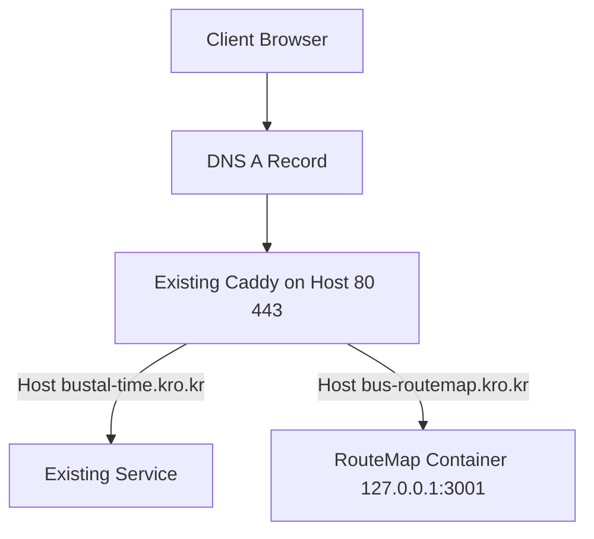

# RouteMap 프로덕션 배포 계획서

## 1. 결론 요약

- 동일한 서버 동일 IP에서도 [`Caddy`](https://caddyserver.com/)의 도메인 기반 가상호스트 라우팅을 사용하면, [`bustal-time.kro.kr`](plans/prod-deploy-plan.md) 와 [`bus-routemap.kro.kr`](plans/prod-deploy-plan.md) 를 모두 80 443 포트로 서비스할 수 있습니다.
- 핵심은 기존 80 443 점유 프로세스를 유지한 채, 기존 Caddy 설정에 신규 도메인 사이트 블록만 추가하고 신규 앱은 내부 포트로만 열어 reverse proxy 하는 방식입니다.

---

## 2. 현재 프로젝트 기준 확인 사항

- [`prod-up`](Makefile:40) 는 [`docker-compose.prod.yml`](docker-compose.prod.yml:1) 기준으로 [`caddy`](docker-compose.prod.yml:24) 컨테이너를 함께 띄우도록 되어 있습니다.
- [`caddy`](docker-compose.prod.yml:27) 는 호스트 80 443을 직접 바인딩합니다.
- [`Caddyfile.prod`](Caddyfile.prod:5) 는 현재 `:443` `:80` 범용 블록이라 단일 서비스 전제입니다.

따라서 **기존 서버에서 이미 Caddy가 80 443을 사용 중**인 상황에서는, 이 프로젝트의 프로덕션 Compose를 그대로 올리면 포트 충돌이 발생합니다.

---

## 3. 목표 아키텍처



운영 원칙

- 외부 공개 포트는 기존 Caddy만 사용
- 신규 RouteMap은 내부 포트 예시 3001로 구동
- 기존 Caddy에 [`bus-routemap.kro.kr`](plans/prod-deploy-plan.md) 블록 추가
- TLS 인증서 발급 및 갱신은 기존 Caddy 체계 재사용

---

## 4. 배포 전 로컬 프로젝트 선반영 항목

서버에서 `git pull` 후 바로 적용되도록, 아래 항목을 로컬에서 먼저 커밋합니다.

1. 프로덕션 Compose 분리
   - 기존 [`docker-compose.prod.yml`](docker-compose.prod.yml:1)에서 [`caddy`](docker-compose.prod.yml:24) 서비스 제거 또는 비활성화용 별도 파일 추가
   - 웹 서비스는 `127.0.0.1:3001:3000` 형태 바인딩으로 외부 직접 노출 차단

2. Caddyfile 운영 방식 정리
   - 프로젝트의 [`Caddyfile.prod`](Caddyfile.prod:1)는 참고용으로 유지 가능
   - 실제 운영은 서버의 기존 Caddy 메인 설정 파일에서 도메인별 라우팅 관리

3. Make 타깃 정리
   - [`Makefile`](Makefile:1)에 서버 환경용 타깃 추가 권장
   - 예시 개념
     - `prod-up-app` 앱만 기동
     - `prod-down-app` 앱만 중지
     - `prod-logs-app` 앱 로그 확인

4. 환경 변수 파일 전략
   - 민감값은 `.env` 계열로 분리
   - 커밋 대상과 서버 수동 관리 대상을 구분

---

## 5. 서버 적용 절차 git pull 기준

### 5.1 사전 점검

1. DNS 확인
   - [`bus-routemap.kro.kr`](plans/prod-deploy-plan.md) A 레코드가 해당 서버 IP를 가리키는지 확인

2. 기존 Caddy 설정 백업
   - 적용 전 기존 설정 파일 백업

3. 현재 서비스 상태 확인
   - 기존 [`bustal-time.kro.kr`](plans/prod-deploy-plan.md) 서비스 응답 정상 확인

### 5.2 코드 반영

1. 서버에서 프로젝트 경로 [`~/routemap`](plans/prod-deploy-plan.md) 이동
2. `git pull`
3. 필요한 경우 `git log -1` 로 반영 커밋 확인

### 5.3 신규 앱 기동

1. 앱 컨테이너만 빌드 및 기동
2. 앱 내부 상태 확인
3. 호스트 로컬에서 `127.0.0.1:3001` 헬스 확인

### 5.4 기존 Caddy에 도메인 라우팅 추가

기존 Caddy 설정에 아래 개념으로 신규 사이트 추가

```caddy
bus-routemap.kro.kr {
    encode gzip
    reverse_proxy 127.0.0.1:3001
}
```

적용 순서

1. Caddy 설정 문법 검증
2. Caddy reload
3. HTTPS 인증서 자동 발급 확인

### 5.5 검증

1. [`https://bus-routemap.kro.kr`](plans/prod-deploy-plan.md) 접속 확인
2. 기존 [`https://bustal-time.kro.kr`](plans/prod-deploy-plan.md) 영향 없음 확인
3. 브라우저 콘솔 네트워크 4xx 5xx 여부 확인
4. 서버 로그에서 에러 추적

---

## 6. 롤백 계획

문제 발생 시 즉시 아래 순서로 복구

1. Caddy 설정을 백업본으로 복원 후 reload
2. 신규 RouteMap 컨테이너 중지
3. DNS 변경이 있었다면 기존값 복구
4. 장애 원인 로그 수집 후 재배포 전 수정 커밋

---

## 7. 위험요소 및 대응

1. 포트 충돌
   - 대응: 신규 Compose에서 호스트 80 443 바인딩 제거

2. 도메인 인증서 발급 실패
   - 대응: DNS 전파 및 80 443 inbound 정책 점검

3. 기존 서비스 영향
   - 대응: Caddy reload 전 설정 검증, 블루그린 대신 최소 변경 적용

4. 앱 기동 실패
   - 대응: 컨테이너 로그 우선 확인 후 이전 이미지로 복구

---

## 8. 최종 실행 원칙

- 코드 변경은 로컬에서 먼저 커밋
- 서버는 pull 기반 반영
- 트래픽 진입점은 기존 Caddy 단일화
- 도메인별 라우팅으로 두 서비스 공존

