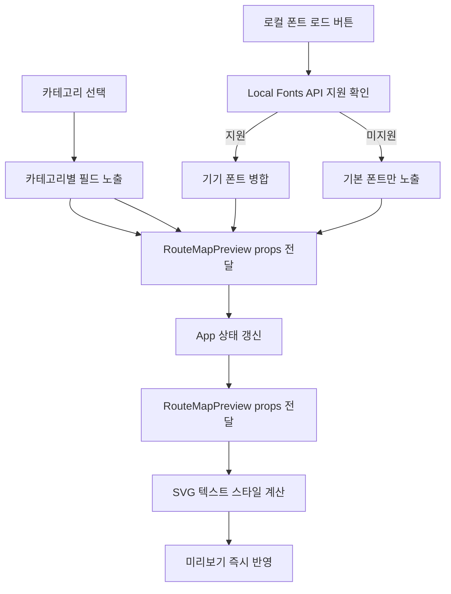

# 노선도 타이포그래피 편집 기능 구현 계획

## 1. 목표와 범위

- 목표: 노선도 편집 화면에서 아래 5개 텍스트 영역의 타이포그래피를 사용자가 직접 편집
  - 출발-도착지
  - 노선정보
  - 정류장명
  - 노선안내도 헤더 타이틀
  - 노선명
- 편집 가능 항목
  - 폰트 패밀리
  - 폰트 크기
  - 자간
  - 장평
- 저장 범위: 세션 메모리 한정
- 폰트 소스
  - 기본 제공 폰트 목록
  - 브라우저 Local Fonts API 지원 시 기기 폰트 목록
  - 미지원 시 기본 제공 폰트만 노출
- 적용 범위: 노선도 편집 화면의 실시간 미리보기

## 2. 현행 구조 분석 요약

- 미리보기 SVG 렌더링은 [`RouteMapPreview`](../src/features/route-map/components/RouteMapPreview.tsx)
  - 루트 폰트 스택이 고정 style 로 선언됨
  - 텍스트 요소별로 fontSize, fontWeight 일부 하드코딩
- 편집 상태는 [`App`](../src/App.tsx) 내부 `useState` 중심
  - 레이아웃 관련은 [`LayoutOverride`](../src/features/route-map/types.ts)
  - 현재 텍스트 스타일 상태는 별도 타입이 없음
- 기본값 상수는 [`constants`](../src/features/route-map/constants.ts)에 관리

## 3. 데이터 모델 설계

### 3.1 신규 타입

- 파일: [`types`](../src/features/route-map/types.ts)
- 추가 타입
  - `TypographyTargetKey`
    - `terminal`
    - `routeInfo`
    - `stationLabel`
    - `headerTitle`
    - `routeName`
  - `TypographyStyle`
    - `fontFamily: string`
    - `fontSize: number`
    - `letterSpacing: number`
    - `fontStretchPercent: number`
  - `TypographySettings = Record<TypographyTargetKey, TypographyStyle>`
  - `FontOption`
    - `id: string`
    - `label: string`
    - `source: preset | local`

### 3.2 기본값 상수

- 파일: [`constants`](../src/features/route-map/constants.ts)
- 추가 상수
  - `defaultTypographySettings`
  - `presetFontFamilies`

### 3.3 가이드 기본값 반영

- 출발-도착지: Noto Sans KR, 40, -100, 80
- 노선정보: Noto Sans KR, 12, -100, 80
- 정류장명: Noto Sans KR, 20, -100, 80
- 헤더 타이틀: Noto Sans KR, 48, -100, 80
- 노선명: 나눔고딕, 120, -30, 90

## 4. 폰트 소스 전략

### 4.1 기본 제공 폰트

- 최소 제공 목록 예시
  - Noto Sans KR
  - 나눔고딕
  - Pretendard
  - Apple SD Gothic Neo
  - Malgun Gothic

### 4.2 기기 폰트 탐색

- 지원 판별: `window.queryLocalFonts` 존재 여부
- 지원 시
  - 사용자 액션 버튼 클릭으로 로드
  - 중복 제거 후 `family` 기준 정렬
  - 기본 제공 폰트와 병합하여 선택 목록 구성
- 미지원 시
  - 안내 문구 노출
  - 기본 제공 폰트만 선택 가능

### 4.3 안정성 가드

- 폰트 선택 시 fallback stack 유지
- 잘못된 값은 기본값으로 즉시 복구

### 4.4 로컬 폰트 저작권 안내

- 로컬 폰트 로드 UI 인접 위치에 안내문 고정 노출
- 안내 목적
  - 기기 폰트 사용 권한 확인 책임이 사용자에게 있음을 명시
  - 결과물 배포 전 라이선스 확인 필요성 고지
- 안내문 예시 문구
  - 기기 폰트 사용 시 해당 폰트 라이선스와 사용 권한은 사용자 책임입니다
  - 상업적 이용 또는 외부 배포 전 폰트 라이선스를 확인하세요
- 노출 조건
  - Local Fonts API 지원 환경에서 로컬 폰트 기능 노출 시 항상 표시
  - 미지원 환경에서는 기능 안내만 표시하고 저작권 문구는 축약 가능

## 5. UI 구성 설계

### 5.1 상단 카테고리 구조

- 편집 카테고리를 아래 7개로 분리
  - 출발-도착지
  - 노선정보
  - 정류장명
  - 노선안내도 헤더 타이틀
  - 노선명
  - 노선선
  - 레이아웃
- UI 동작
  - 상단에서 카테고리 1개 선택
  - 하단 영역에 선택 카테고리 전용 편집 필드만 표시

### 5.2 카테고리별 편집 항목

- 출발-도착지
  - 폰트 패밀리
  - 폰트 크기
  - 자간
  - 장평
- 노선정보
  - 폰트 패밀리
  - 폰트 크기
  - 자간
  - 장평
- 정류장명
  - 폰트 패밀리
  - 폰트 크기
  - 자간
  - 장평
  - 각도
- 노선안내도 헤더 타이틀
  - 폰트 패밀리
  - 폰트 크기
  - 자간
  - 장평
- 노선명
  - 폰트 패밀리
  - 폰트 크기
  - 자간
  - 장평
- 노선선
  - 두께
  - 점 크기
  - 유턴 반경
  - 유턴-인접정류장 간격
- 레이아웃
  - 좌측 기준선
  - 우측 기준선

### 5.3 상태 매핑 원칙

- 타이포그래피 상태
  - 출발-도착지, 노선정보, 정류장명, 헤더 타이틀, 노선명
- 레이아웃 상태
  - 노선선, 레이아웃
- 기존 값 재사용
  - 정류장명 각도는 [`LayoutOverride.labelAngle`](../src/features/route-map/types.ts:108) 재사용
  - 노선선과 레이아웃 항목은 [`LayoutOverride`](../src/features/route-map/types.ts:107) 필드 재사용

### 5.4 상호작용

- 값 변경 시 즉시 미리보기 반영
- 변경 시 [`touchStage`](../src/App.tsx:112)로 `global` 또는 `layout` 터치
- 히스토리 스냅샷에 포함하여 undo redo 일관성 유지
- 로컬 폰트 선택 영역에는 저작권 안내 텍스트를 시각적으로 구분해 표시

## 6. 렌더링 적용 설계

### 6.1 전달 구조

- [`App`](../src/App.tsx)에서 `typographySettings` 상태 관리
- [`RouteMapPreview`](../src/features/route-map/components/RouteMapPreview.tsx)에 props 전달

### 6.2 SVG 텍스트 적용 방식

- 각 텍스트 요소에 공통 헬퍼 적용
  - `fontFamily`
  - `fontSize`
  - `letterSpacing` 단위 보정
  - `transform` 기반 장평 적용
- 타겟별 매핑
  - 출발-도착지: 상단 terminal 텍스트
  - 노선정보: 회사 문의 및 배차 안내 텍스트
  - 정류장명: 정류장 라벨 텍스트
  - 헤더 타이틀: 로고 옆 타이틀 텍스트
  - 노선명: 우측 대형 노선명

### 6.3 장평 처리 원칙

- SVG 에서 직접 `font-stretch` 일관성이 낮아 transform 기반 스케일 권장
- 기준 앵커 유지
  - `textAnchor=start|middle|end`별 기준점 불변
  - 스케일로 인한 위치 틀어짐 보정 로직 포함

## 7. 구현 순서

1. 타입 확장
   - [`types`](../src/features/route-map/types.ts)에 타이포그래피 타입 추가
2. 기본값 상수 추가
   - [`constants`](../src/features/route-map/constants.ts)에 기본 스타일과 폰트 프리셋 선언
3. 폰트 유틸 작성
   - Local Fonts API 지원 판별 및 목록 정규화 유틸 추가
4. 앱 상태 연결
   - [`App`](../src/App.tsx)에 `typographySettings`, `fontOptions`, `localFontsSupported` 상태 추가
   - undo redo 스냅샷 타입에 반영
5. 편집 UI 추가
   - 패널에 5개 타겟 편집 입력 컴포넌트 추가
   - reset 액션 및 stage touch 연결
6. 미리보기 props 확장
   - [`RouteMapPreview`](../src/features/route-map/components/RouteMapPreview.tsx) props 에 typography 전달
7. 편집 카테고리 UI 적용
   - 7개 카테고리 탭 선택 구조 구현
   - 선택 카테고리별 필드 조건부 렌더링 연결
8. SVG 스타일 적용
   - 5개 텍스트 타겟 각각에 폰트, 크기, 자간, 장평 적용
   - 정류장명 각도는 기존 레이아웃 각도와 연결
   - 노선선 및 레이아웃 항목은 기존 레이아웃 제어값과 연결
9. 검증
   - Local Fonts API 지원 브라우저와 미지원 브라우저 모두 수동 점검
   - 값 경계 테스트
   - 로컬 폰트 노출 조건별 저작권 안내 문구 표시 여부 점검

## 8. 검증 체크리스트

- 7개 카테고리에서 지정된 필드만 노출
- 5개 텍스트 타겟이 각각 독립 편집 가능
- 기본값 reset 시 디자인 가이드 값으로 복귀
- Local Fonts API 미지원 환경에서 오류 없이 동작
- Local Fonts API 지원 환경에서 저작권 안내 문구가 항상 노출
- undo redo 에서 텍스트 스타일 변경 이력 정상 동작
- 실시간 미리보기 반영 지연 없음

## 9. 리스크와 대응

- 브라우저별 로컬 폰트 권한 정책 차이
  - 대응: 기능 버튼형 로드 + 실패 메시지 + 기본 폰트 fallback
- SVG 장평 표현 편차
  - 대응: transform 기반 통일 처리와 기준점 보정
- 글자 크기 대폭 증가 시 겹침
  - 대응: 초기 범위 제한과 경고 문구

## 10. 작업 흐름 다이어그램

